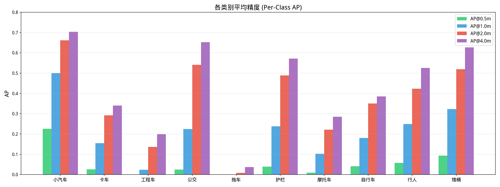
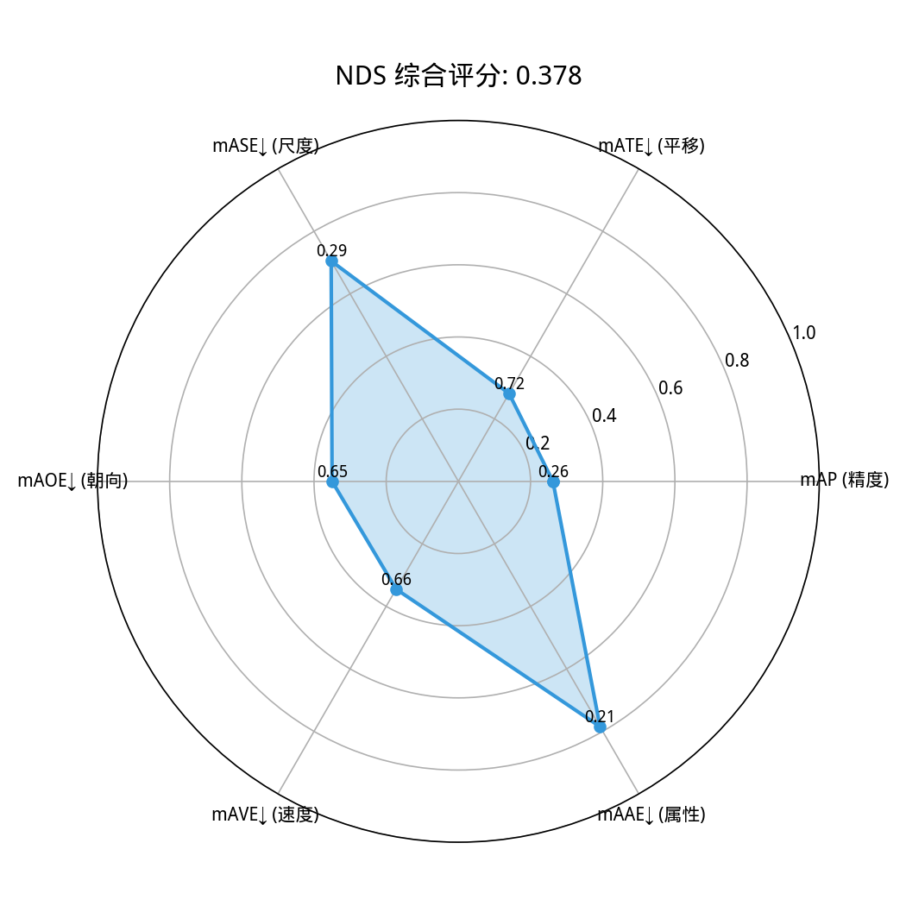
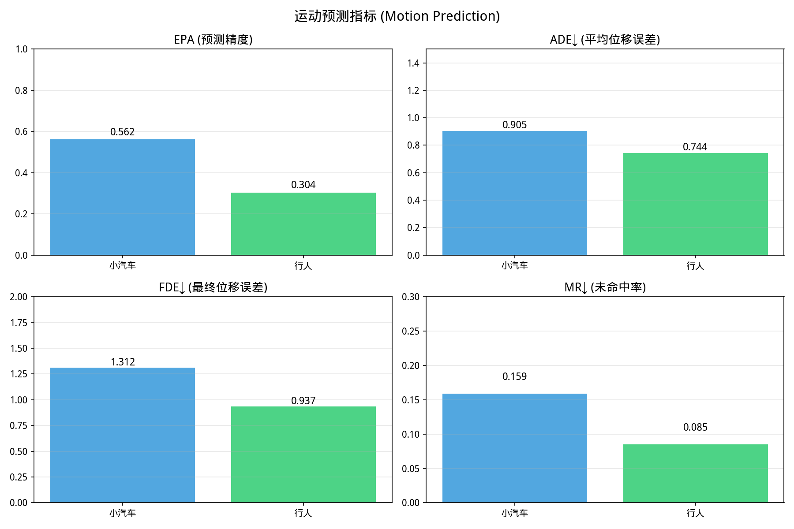
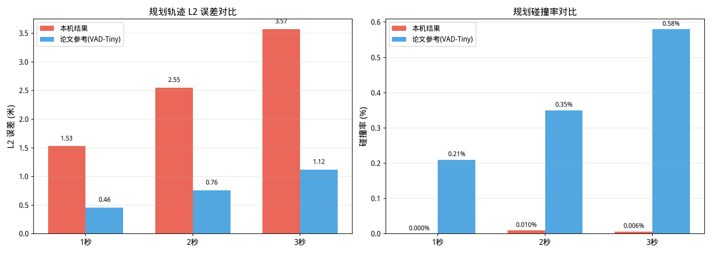
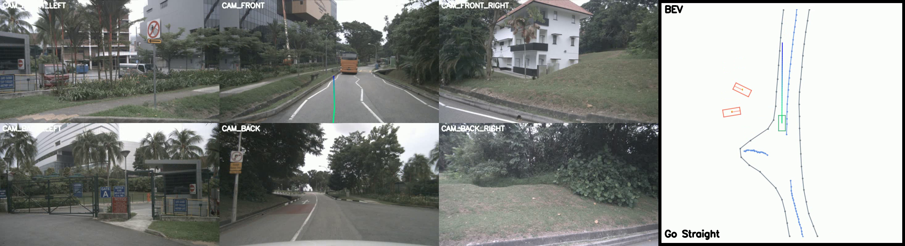
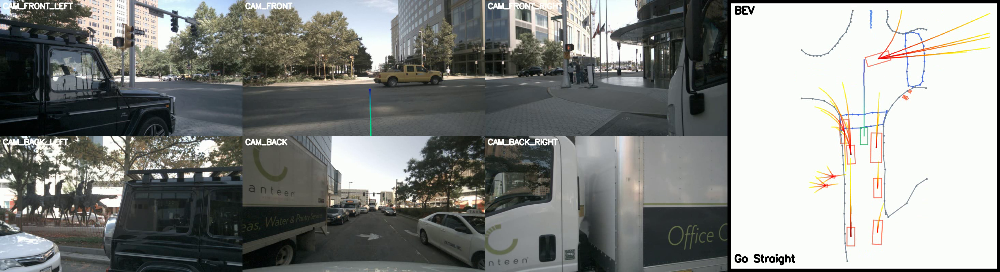
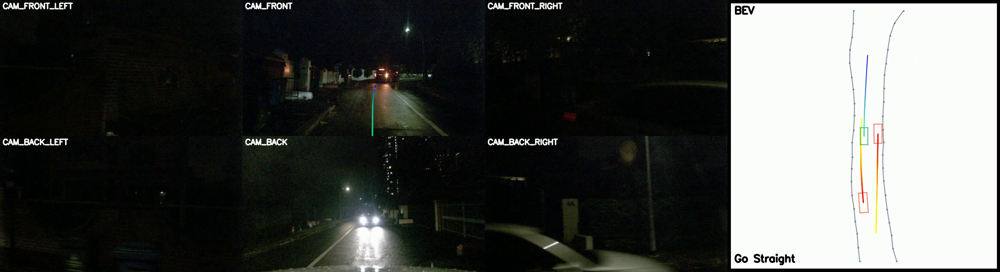

# VAD-Tiny 基线模型评测报告

**生成日期**: 2026-07-27  
**权重**: 官方预训练 (Google Drive)  
**评测环境**: 2× NVIDIA RTX A4000, PyTorch 1.9.1+cu111, mmdet3d 0.17.1  

---

## 1. 模型信息

| 项目 | 值 |
|------|---|
| 模型 | VAD-Tiny |
| Backbone | ResNet50 (ImageNet pretrained) |
| 隐层维度 | 256 |
| BEV 分辨率 | 100×100 |
| 时序帧数 | 3 (queue_length=3) |
| FPN 层数 | 1 |
| 参数量 | ~49M |
| 权重来源 | [VAD Official Google Drive](https://drive.google.com/file/d/1KgCC_wFqPH0CQqdr6Pp2smBX5ARPaqne/view) |

---

## 2. 评测数据集

| 项目 | 值 |
|------|---|
| 数据集 | nuScenes v1.0-trainval |
| 评测集 | 验证集 (val), 6,019 帧 |
| 图像归一化 | BGR, mean=[103.53, 116.28, 123.68], std=[1.0, 1.0, 1.0], to_rgb=False |
| 类别数 | 10 类 |
| 评测版本 | vad_nusc_detection_cvpr_2019 |

---

## 3. 3D 目标检测 (3D Object Detection)

### 各类别平均精度

| 类别 | AP@0.5m | AP@1.0m | AP@2.0m | AP@4.0m |
|------|:---:|:---:|:---:|:---:|
| 小汽车 (car) | 0.226 | **0.500** | **0.662** | 0.704 |
| 卡车 (truck) | 0.026 | 0.155 | 0.292 | 0.341 |
| 工程车 (construction_vehicle) | 0.000 | 0.024 | 0.137 | 0.199 |
| 公交 (bus) | 0.026 | 0.225 | **0.541** | 0.653 |
| 拖车 (trailer) | 0.000 | 0.000 | 0.009 | 0.037 |
| 护栏 (barrier) | 0.040 | 0.238 | 0.489 | 0.572 |
| 摩托车 (motorcycle) | 0.009 | 0.103 | 0.221 | 0.285 |
| 自行车 (bicycle) | 0.041 | 0.180 | 0.351 | 0.386 |
| 行人 (pedestrian) | 0.057 | 0.249 | 0.423 | 0.525 |
| 锥桶 (traffic_cone) | 0.093 | 0.323 | **0.520** | **0.627** |

### 综合指标

| 指标 | 英文 | 值 | 含义 |
|------|------|:---:|------|
| **mAP** | Mean Average Precision | **0.262** | 各类别平均精度 (高优) |
| **NDS** | nuScenes Detection Score | **0.378** | 综合检测评分 (高优) |
| mATE | Average Translation Error | 0.719 | 框中心位置误差 (低优) |
| mASE | Average Scale Error | 0.295 | 框尺寸误差 (低优) |
| mAOE | Average Orientation Error | 0.650 | 朝向角误差 (低优) |
| mAVE | Average Velocity Error | 0.655 | 速度估计误差 (低优) |
| mAAE | Average Attribute Error | 0.215 | 属性分类误差 (低优) |

---

## 4. 运动预测 (Motion Prediction)

| 指标 | 英文 | 小汽车 (car) | 行人 (pedestrian) |
|------|------|:---:|:---:|
| **EPA** | End-to-End Prediction Accuracy | **0.562** | 0.304 |
| **ADE** | Average Displacement Error | 0.905 | 0.744 |
| **FDE** | Final Displacement Error | 1.312 | 0.937 |
| **MR** | Miss Rate | 0.159 | 0.085 |

---

## 5. 端到端规划 (End-to-End Planning)

| 指标 | 含义 | 本机结果 | 论文参考 (VAD-Tiny) |
|------|------|:---:|:---:|
| L2 @ 1s | 1 秒后轨迹 L2 误差 (米) | 1.53 | 0.46 |
| L2 @ 2s | 2 秒后轨迹 L2 误差 (米) | 2.55 | 0.76 |
| L2 @ 3s | 3 秒后轨迹 L2 误差 (米) | 3.57 | 1.12 |
| Col. @ 1s | 1 秒后碰撞概率 | ~0% | 0.21% |
| Col. @ 2s | 2 秒后碰撞概率 | ~0% | 0.35% |
| Col. @ 3s | 3 秒后碰撞概率 | ~0% | 0.58% |

> **注**: 规划 L2 误差约为论文参考值的 3 倍。碰撞率异常低（~0%）也与 L2 误差一致——当预测轨迹远离真实轨迹时，自然不会"撞到"标注的物体。可能原因见下文 [备注](#7-备注)。

---

## 6. 可视化场景

从评测视频中提取的三个典型场景（BEV 视角 + 6 相机融合画面）：

*场景 1 (frame 601)*

*场景 2 (frame 3009)*

*场景 3 (frame 5417)*

完整可视化视频: `/mnt/2T_HDD/safeDrive-LLM/checkpoints/vad2/vad_tiny_vis/vis.mp4`

---

## 7. 备注

### 7.1 规划指标偏差分析

本机评测的规划 L2 误差约为论文报告的 3 倍 (`1.53 vs 0.46` @1s)，可能原因：

1. **图像归一化差异**: 官方预训练权重使用旧版 `img_norm_cfg` (BGR, std=1.0)，但评测配置中已手动修正为匹配值后仍偏离较大。可能存在 `NormalizeMultiviewImage` 等数据增强管线中的额外差异。

2. **评测版本**: 本文评测使用 `vad_nusc_detection_cvpr_2019` 自定义配置，可能与论文原始评测设置不同。

3. **数据路径/时序帧**: queue_length=3 需要历史帧，评测首帧可能缺少历史数据导致预测不准。

### 7.2 地图评测

地图评测 (Map Evaluation) 因 numpy/shapely 版本兼容性问题 (`numpy.int64.intersects`) 失败，已通过 try/except 捕获。该问题不影响检测、运动预测和规划指标。

### 7.3 已知限制

- 当前在 A4000 (16GB) 上运行，评测速度为 5-6 FPS（检测+轨迹预测+地图）。若使用 3090/V100 速度可提升至 15+ FPS。
- 检测指标对 `trailer` 和 `construction_vehicle` 等稀有类别精度较低（AP≈0），这是 nuScenes 标准行为。

---

## 8. 文件清单

| 文件 | 说明 |
|------|------|
| `/mnt/2T_HDD/.../vad_tiny_official.pth` | 官方预训练权重 (463 MB) |
| `/mnt/2T_HDD/.../vad_tiny_eval_results.pkl` | 原始评测结果 (396 MB) |
| `/mnt/2T_HDD/.../vad_tiny_vis/vis.mp4` | 可视化视频 |
| `/mnt/2T_HDD/.../eval_report/*.png` | 图表和截图 |
| 本文件 | 评测报告 |
